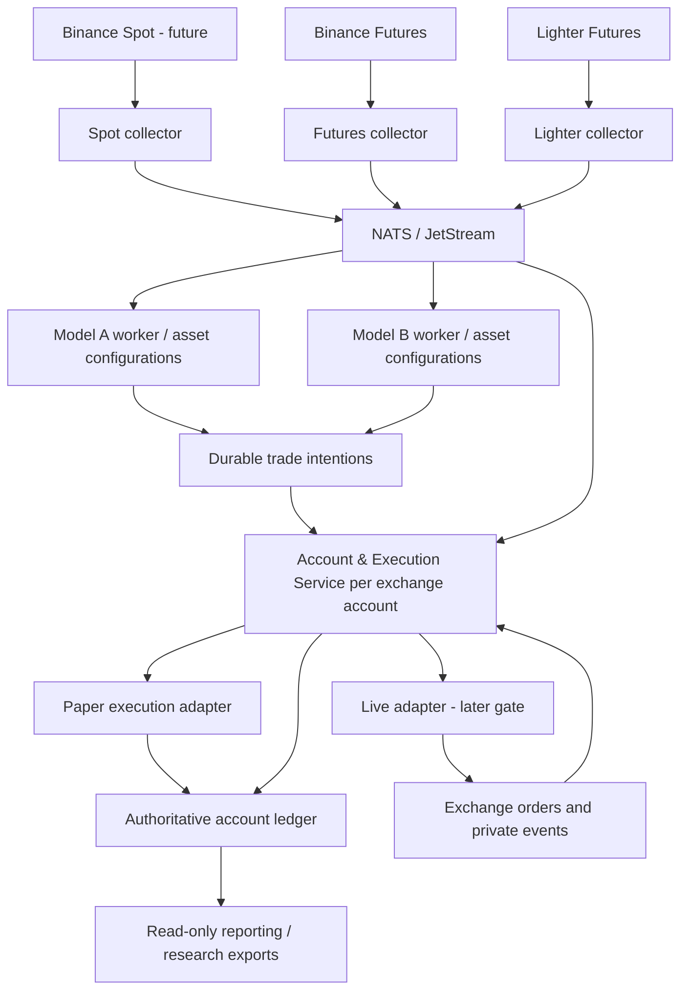

# Golden Goose — Trading Platform Architecture V1

Date: 2026-10-04 (Asia/Jakarta)

Status: **FINAL DESIGN V1 — implementation has not started.**

This document is the implementation reference for the reusable platform. It freezes architectural boundaries and migration requirements, not trading profitability or new strategy rules. Model rules and research findings remain under their respective model folders. Existing running services continue until a replacement passes the migration gates below.

## 1. Objective and scope

Build a small, recoverable trading platform in which multiple models can consume shared venue-native data without sharing mutable strategy state or accidentally spending the same capital. Begin on the existing single DigitalOcean VPS with Docker Compose; scale only after measuring resource usage.

Initial migration scope:

- Existing Binance Futures and Lighter Futures feeds.
- Existing trend_following_preny_profile_15m model and its ETH, BNB and HYPE configurations.
- Paper execution, isolated virtual allocations, durable decisions and accounting.
- A clean separation between research, strategy evaluation, market data and position management.

Binance Spot is a supported future adapter boundary, not a collector to start before it is needed. Other models and markets are migrated individually. Listing gold, oil or crypto in a configuration does not establish instrument availability; native specifications must be validated first.

Not part of this implementation: new entry filters, new alpha indicators, parameter optimization, automatic capital optimization, enabling real orders, high-availability clustering, Kubernetes, a permanent raw-tick warehouse, or a rewrite of all existing engines.

## 2. Final decisions

| Area | V1 decision |
| --- | --- |
| Repository | One monorepo; explicit runtime/research dependency boundaries |
| Reuse | Extract existing deterministic calculations; avoid parallel implementations |
| Collector isolation | One service per venue/product initially; markets isolated within it |
| Data distribution | One private NATS broker, with JetStream for replayable events |
| Strategy isolation | One worker per deployed model/version/venue initially; multiple asset configurations allowed |
| Account ownership | One Account & Execution Service owns each exchange account's mutable state |
| Risk and accounting | Modules inside the account service initially; reserve capital and record intentions atomically |
| Storage | SQLite per owning service, one coordinated writer; NATS storage is transport/replay, not the accounting ledger |
| Environments | local-dev, server-paper, server-live; independent databases and credentials |
| Git | Temporary branches -> reviewed main -> tagged, immutable releases |
| Deployment | Build an image once, test in paper, promote its exact digest deliberately |
| Infrastructure | Docker Compose on the existing VPS first; measured resource budgets |
| Live credentials | Absent from paper and research; real-order integration is a later explicit gate |

## 3. Data and decision flow



The diagram shows logical ownership. Shared code is allowed; shared writable databases between these owners are not. A reporting process may consume consistent exports or read-only views but cannot update operational state.

## 4. Market Data Service

Responsibilities:

1. Discover and validate subscribed native instruments and specifications.
2. Maintain public market connections, source checkpoints, reconnect and supported backfill.
3. Validate event identity, ordering, timestamps, quantities and aggressor-side semantics.
4. Build shared primitives incrementally: completed candles, buy/sell volume, delta and volume-at-price.
5. Publish data, coverage status and corrections with explicit provenance.

A subscription registry supplies the union of instruments required by active models and open positions. Several consumers do not create duplicate upstream subscriptions. High-volume markets may be split into additional connections/processes later, using the same interface.

Instrument identity must include venue, product type and native instrument ID; registry metadata includes settlement/collateral currency, contract multiplier, price tick, quantity step, minimum order size, status and applicable trading schedule. Internal research aliases are display/mapping metadata, never the unique market identity.

Event envelope:

- schema_version, event_id, event_type, source and instrument_id;
- source event time and local receive time in UTC;
- venue sequence/trade identity where provided, plus local stream sequence;
- coverage/quality status, payload and revision identity where relevant.

Do not assume different venues have consecutive trade IDs or identical buy/sell flags. Preserve source-specific validation in each adapter. Store timestamps in UTC; session rules explicitly use America/New_York and handle daylight saving changes.

Completed-bar events carry end time, available_at time and coverage. A missing minute is zero-volume only when continuity supports that interpretation. A gap in collection remains a gap. Corrections never silently rewrite a decision that already occurred.

Data quality is per instrument and per channel. Report connection heartbeat, last event, quote age, coverage gaps and consumer lag separately. A quiet market is not automatically a disconnected feed. Model readiness depends on its required inputs, rather than one global healthy flag.

## 5. Data volume, persistence and delivery

| Data class | Processing and retention |
| --- | --- |
| Raw trades | Fold into aggregates once; no permanent full raw archive by default |
| Execution-sensitive trades/quotes | Bounded replay retention for instruments with pending/open paper positions; preserve required event order |
| Best bid/ask | Latest valid quote in memory plus decision/fill snapshots; execution-sensitive intervals require replay or an explicit gap status |
| Full order book | Deferred; add only when position size/liquidity requires it |
| Candles and volume/delta | Durable compact history, sufficient for model warmup and audit |
| Volume-at-price | Durable aggregate sufficient to reproduce the specified profile algorithm; do not substitute candle volume silently |
| Mark price/funding/specifications | Timestamped compact records and settlement/specification events |
| Decisions/orders/fills/ledger | Durable, complete records retained with the release that produced them |
| Diagnostics | Rotated logs and bounded failure samples |

Retention time, disk caps and batch size are operational configuration established by the load test, not new trading parameters. Initial replay budget must accommodate at least the planned controlled restart; recovery outside retention requires supported venue backfill or an explicit unobservable interval. A disk cap must never silently turn lost events into a continuous path.

NATS Core is suitable for expendable latest-value updates. JetStream is used for completed bars, coverage events, intentions, fills and the bounded execution replay stream. Pure Core delivery is insufficient for accounting or stop-path recovery.

Delivery contract:

- Each independent strategy has its own consumer. Different strategies must not share a work queue that distributes events between them.
- Expect at-least-once delivery for durable events. Apply event IDs idempotently.
- Commit the local state update and pending publication together (transactional outbox), then publish and record acknowledgment.
- Consumers commit their state/checkpoint before acknowledging an event.
- Backlogs are bounded and monitored. A slow strategy cannot block ingestion for other strategies.
- After restart, replay reconstructs state but cannot place an entry whose expiry has passed.
- Cross-channel data uses explicit as-of/availability times; arrival order alone is not a causal guarantee.

Do not promise exact paper fills across an unrecoverable execution-data gap. Mark affected intervals/trades uncertain and exclude them from claims of verified fill parity until reviewed.

## 6. Strategy worker and shared calculations

A strategy consumes validated inputs and produces decisions and trade intentions. It does not own exchange credentials, account balances or mutable order state.

An intention contains model/contract version, allocation ID, instrument, direction, signal time, eligible time, expiry, proposed risk tier, initial stop, exit policy and a decision snapshot reference. Every intention has a deterministic unique ID.

Common calculations live in trading_core after extraction from existing code: profile mathematics, indicators, signal data types and position mathematics. Model-specific evaluation remains in models/<model>/runtime. Calculation functions accept explicit data/configuration; they do not fetch data, read hidden global state or inspect future outcomes.

Research and backtest call this evaluator too. MFE labels, forward returns, sweep ranking and outcome-dependent analysis stay in research. Runtime imports from research, notebook or runs directories are prohibited and checked before release.

Identical feature requests can share a cache keyed by venue/instrument, as-of time, parameters, source revision and implementation version. Different profile windows or indicator definitions are different cache keys. No cross-venue feature fallback is allowed without a separately approved model contract.

V1 granularity: one model/venue worker may evaluate several asset configurations. Separate unrelated models into separate processes. A worker failure does not stop account position management.

## 7. Account, execution and capital ownership

One Account & Execution Service owns each real exchange account (or explicitly separate paper account group). Allocation, sizing, order management, positions and ledger are modules inside that owner for V1.

The service validates an intention, checks allocation/margin, calculates quantity, applies instrument rounding/minimums, reserves resources and persists an order intention atomically. Model-requested risk is a proposal bounded by its contract and account limits.

Virtual allocation identity includes environment, venue/account, model version and asset/configuration. Capital is assigned once. Several models cannot each treat the full wallet balance as their own allocation.

Maintain separately:

- allocated capital, reserved margin and available margin;
- realized P&L, unrealized P&L, fees and funding;
- historical closed-equity sizing basis where required by the frozen contract;
- exchange position versus internal strategy ownership;
- deposits, withdrawals and explicit allocation transfers.

An accounting method change must not silently change the frozen sizing policy. Cross-margin sharing at an exchange remains real even when virtual ledgers are isolated. Actual collateral isolation requires suitable separate accounts/subaccounts and is a later venue-specific decision.

V1 permits one active position owner per instrument/exchange account. Supporting multiple simultaneous strategy owners requires explicit net-position and fill-allocation rules before enabling it. Do not automatically net opposing strategies without that contract.

Position management is independent of strategy uptime. A wall-clock scheduler creates due time-exit intentions even when no new candle arrives. If valid execution prices are unavailable, record the delay; do not invent a fill at the deadline.

Paper and live share intention/order state definitions and deterministic calculations. They use different execution adapters. Paper fills never appear as real exchange fills. A future live adapter must reconcile unknown submission outcomes using stable client order IDs before retrying, reconcile at startup, and support exchange-native protective orders where applicable.

## 8. Paper fidelity and later live gate

Current public feeds already use native mainnet market data. Account authentication is not required to make this data real.

The next paper-fidelity increment is fresh best bid/ask and instrument limits, then venue-specific fee/funding treatment. Market buys use the ask side and sells the bid side in the approximation, with quantity/latency limitations documented. Top-of-book does not prove large orders can fill completely; insufficient visible size must not receive an optimistic guaranteed fill. Depth is added only if needed.

Preserve the contract's stop trigger basis. Do not switch from last-trade to mark-price triggers during infrastructure migration. Changes to fill semantics or costs get a new simulation version and a separate ledger/run, so older results remain interpretable.

Actual account read access, testnet order plumbing and mainnet live execution are separate future integrations. Paper and research receive no trade-signing credentials. Live activation requires explicit review of order/stop recovery and account allocation; it is not triggered by a successful git push.

## 9. Repository and environments

Target layout; migrate existing implementations instead of duplicating them:

```text
golden-goose-project/
  trading_core/          # Shared deterministic calculations and schemas
  market_data/           # Collectors, validation, aggregation, replay
  live_engine/           # Runners, account/execution, ledger, reporting interfaces
  backtest_engine/       # Existing reusable replay/sweep infrastructure
  risk_research/         # Existing reusable stress/Kelly/sizing tools
  models/<model>/
    runtime/
    contracts/
    research/
    findings/
    runs/                # Large generated outputs: excluded from Git/images
    tests/
    deploy/              # Model-specific deployment configuration
  infra/
    deploy/              # Shared infrastructure Compose and release manifests
    monitoring/
    backup/
  tests/
  docs/architecture/
```

Research stays under its model unless it is genuinely reusable infrastructure. Existing storage/cache/output folders may remain outside Git; do not move large datasets as part of this refactor. Curated research manifests, methodology and findings belong in Git; large run artifacts require separate retention/backup.

| Environment | Location | Orders and state |
| --- | --- | --- |
| local-dev | Laptop | Experiments, replay, fixtures; no production credentials or writable production DB |
| server-paper | VPS | Mainnet data, virtual execution; dedicated persistent state |
| server-live | Later deployment | Real execution; separate credentials, state and explicit activation |

Environment does not equal branch. Runtime images include only an allowlisted runtime dependency closure, not the entire research tree or datasets. No editable host source mount in server deployments. Research uses consistent exports rather than modifying live SQLite files.

Configuration classes:

1. Versioned model rules: evaluation, risk tiers, exits and calibration references.
2. Versioned non-secret deployment configuration: enabled instruments/models, allocations, service limits, DB paths and execution mode.
3. Secrets: server-only files mounted only to authorized services; never in Git, image layers, logs or chat.
4. Mutable operational state: persistent database, not environment variables.

Docker Compose secrets restrict which service receives a secret file; host storage still needs permissions and protection. Model parameters must not be overridden invisibly through ad-hoc environment variables.

## 10. Git, builds and release provenance

Use temporary branches, review/tests, and main as the integration branch. No permanent development/staging/production branch set is required. The existing deploy/orb-live-agent branch must be reconciled with main after inventory; do not reset or overwrite local work to force that transition.

Release flow:

```text
branch -> tests/review -> main -> tagged build -> immutable image digest
       -> server-paper validation -> deliberate promotion of same digest to live
```

Build once with pinned dependency versions; reference a digest in the deployment manifest. Updating dependencies is a new build/release. Tags are human labels; the recorded digest identifies actual image content.

Every decision/run records code commit, image digest (or local run code identity), model contract, configuration hash, calibration identity and validity, source/feature versions, environment and venue.

Research runs additionally record dataset fingerprints, time splits, target definitions and random seeds where relevant. Training-only calibrations and expired/missing artifacts must be distinguishable from a valid no-trade decision.

GitHub CI may test and publish images automatically. Deployment remains explicit initially. No auto-update container pulls latest into production. Server source edits are not a release procedure.

Rollback is planned with DB schema compatibility and open-position handling. Restore is not an instruction to replace current exchange state with an old backup: future live recovery must reconcile the exchange before acting.

## 11. Failure containment, resources and operations

| Failure | Required behavior |
| --- | --- |
| Invalid BNB data | Block affected BNB-dependent decisions; keep valid ETH/HYPE processing |
| Lighter connection gap | Stop new affected entries, repair or mark coverage incomplete; Binance continues |
| Strategy crash | Account owner continues stop/exit management; strategy resumes from checkpoint |
| Duplicate event/intention | Idempotent state change; no duplicate order or ledger posting |
| Broker outage | Persist pending publications, pause unavailable-data entries, recover subscriptions/checkpoints |
| Ledger unavailable | No unrecorded new orders; alert and enter defined recovery behavior |
| VPS failure | Recover from persistent state/off-host backup; single-host downtime is acknowledged |

Use Docker Compose with explicit resource limits and bounded queues/log retention. Benchmark collector throughput, strategy latency, memory, disk growth and restart recovery under busy-market load. No claim that 2 GB can support an arbitrary number of markets/models.

Initially deploy two active collectors, one broker, one strategy worker per model/venue, and account owners for the two paper venue groups. Start no unused Spot collector. Reuse common images where practical; minimize collector dependencies. Separate services need not mean separate repositories or servers.

Monitor per-instrument coverage/quote age, connection heartbeat, pending/rejected decisions, consumer backlog, evaluation latency, order/position state, upcoming exit deadlines, calibration expiry, DB/disk health and process resource consumption. Alert on actionable changes, not every tick.

Health status alone does not prove trade readiness or profitability. Docker restart policies recover exited processes; an unhealthy running process needs explicit handling. Single-host containers and a single broker are not high availability. Use consistent SQLite backups, off-host copies and a restore drill. Retention and backup cadence are operational settings finalized during capacity testing.

## 12. Migration plan and acceptance gates

Implement one phase at a time. An architecture refactor does not authorize changing entry/exit rules or cleaning unrelated legacy code.

| Phase | Deliverable | Gate before moving on |
| --- | --- | --- |
| 0. Inventory and baseline | Actual deployed commit/image/config identities; local dirty-work inventory; small replay fixtures; DB backup | Existing model outputs and current limitations recorded; no unrelated changes lost |
| 1. Contracts and extraction | Event/intention schemas, deterministic shared functions, dependency boundaries | Current evaluator decisions unchanged on fixtures; runtime cannot import research |
| 2. Collector separation | Binance/Lighter collectors, broker, compact history, coverage/replay | Candle, delta and profile parity; reconnect/duplicate tests; resource budget passes |
| 3. Strategy consumers | Model workers consume shared data with independent cursors | Same causal decisions and expiry behavior; one worker failure does not stall others |
| 4. Account ownership | Independent position/exit scheduler and allocation/ledger owner | Atomic reservations, partial/stop/time exit, restart and replay do not duplicate state |
| 5. Paper fidelity | BBO approximation, specifications, fee/funding versions | Side/size/quote-age checks and costs audited; results distinguished from previous fill model |
| 6. Release and operations | Immutable images, paper promotion, alerts, backups and rollback runbook | Full paper-session/recovery drill and resource measurements pass |
| 7. Live readiness - later | Account integration and real adapters | Separate explicit authorization and completed venue/account execution checks |

During shadow comparison, a new implementation uses separate state and cannot submit real orders. At cutover there is one active account writer; preserve/drain pending positions deliberately rather than starting two owners on the same DB. Broker redelivery is not permission to re-enter an already consumed session.

Parities compare identical source events and availability times. Numerical tolerances must be declared before comparison and must not hide a change in decisions. Paper fill economics are deliberately reviewed in Phase 5, after data/evaluator parity, to avoid confusing a migration defect with a fill-model change.

## 13. Current deployment handoff

As last reported by the user, Binance and Lighter services run in simulated mode on the VPS. They currently combine collection and evaluation; no claim is made that the final architecture above exists yet. The current paper execution uses next-public-print proxies.

Keep the current deployment running while preparing Phase 0 and replay fixtures. No daily restart is required. A suggested 2-4 week initial observation window is for operational evidence, not an automatic live-trading approval or proof of edge.

Known readiness items from the current implementation:

- Lighter ETH/BNB require earlier native reference sessions with usable coverage.
- Lighter HYPE requires its own native C1 calibration; waiting alone does not install one.
- Binance HYPE's current dated artifact is valid through 2026-10-31; expiry must produce NOT_READY and an actionable alert until a valid artifact is supplied.
- Distinguish quiet-market trade age from connection failure.
- Inspect early candidate decisions when SESSION_LOCKED appears; a session lock does not prove a trade filled.

Future capability changes are amendments to this document, with a reason and version. Numerical resource/retention settings may be tuned from operational measurements without changing trading rules. Model changes require their own contract version and research record.

## 14. References

- [NATS Core delivery and JetStream distinction](https://docs.nats.io/learn/core-nats/)
- [JetStream consumers and acknowledgments](https://docs.nats.io/learn/jetstream/pull-consumers)
- [SQLite WAL and writer constraints](https://sqlite.org/wal.html)
- [Docker resource constraints](https://docs.docker.com/engine/containers/resource_constraints/)
- [Docker build practices](https://docs.docker.com/build/building/best-practices/)
- [Docker Compose secrets](https://docs.docker.com/compose/how-tos/use-secrets/)
- [GitHub Flow](https://docs.github.com/en/get-started/using-github/github-flow)
- [GitHub deployment environments and plan availability](https://docs.github.com/en/actions/how-tos/deploy/configure-and-manage-deployments/manage-environments)

These references support infrastructure mechanics; the design choices, model ownership and migration gates above are specific to this project.
